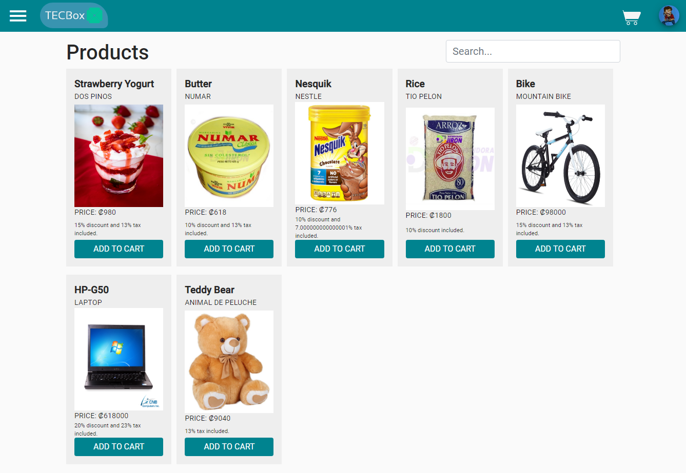
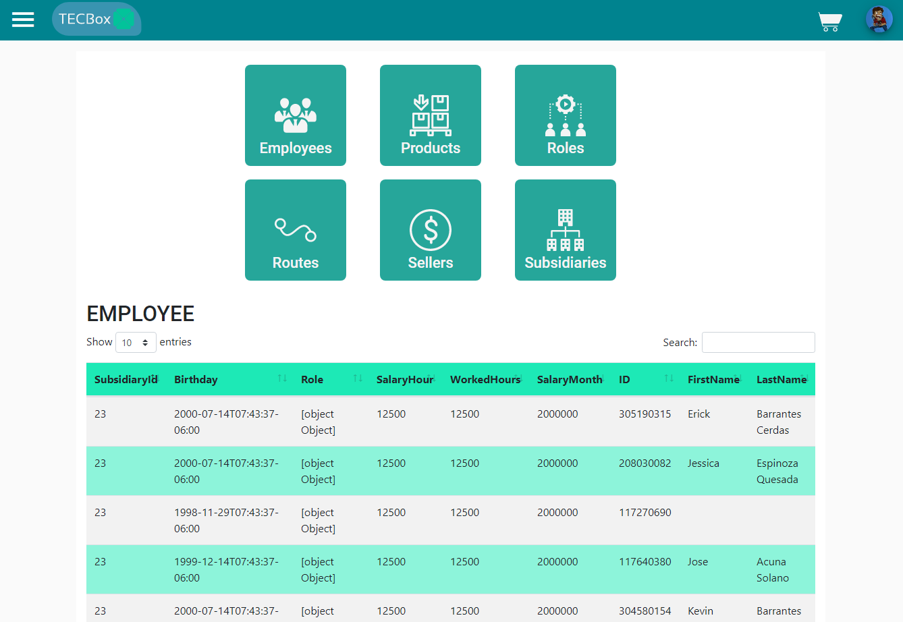

## App preview
 

## Downloads
* [TECBoxWeb](https://github.com/JoDaniel1412/TECBoxWeb/releases)
* [TECBoxService](https://github.com/JoDaniel1412/TECBoxService/releases)
* [TECBoxMobile](https://github.com/JoDaniel1412/TECBoxMobile/releases)

## Documentation
* [Installation manual](doc/Installation%20manual.pdf)
* [User manual](doc/User%20manual.pdf)
* [Technical documentation](doc/Technical%20documentation.pdf)
* [Task distribution](doc/Task%20distribution.pdf)
* [Architecture diagram](doc/Architecture%20Diagram.pdf)
* [Class diagram](doc/Class%20Diagram%20API.pdf)
* [Conceptual diagram](doc/Conceptual%20Diagram.pdf)

## Developers
* **José Acuña** - GitHub: [JoDaniel1412](https://github.com/JoDaniel1412)
* **Erick Barrantes** - GitHub: [ErickCR12](https://github.com/ErickCR12)

## License

This project its under the license (GNU GENERAL PUBLIC LICENSE v3) - read the file 
[LICENSE](LICENSE.md) for more details.
